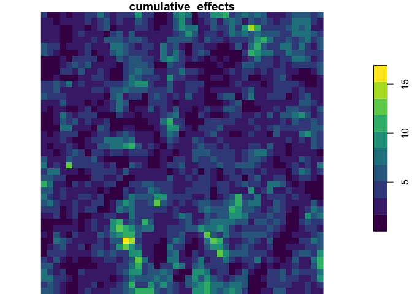
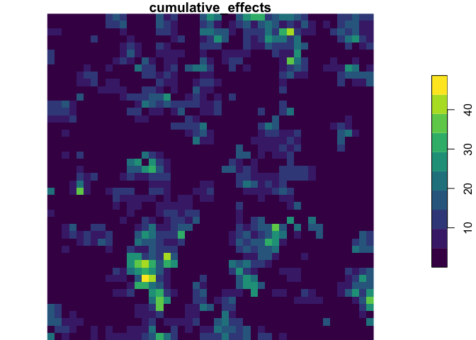
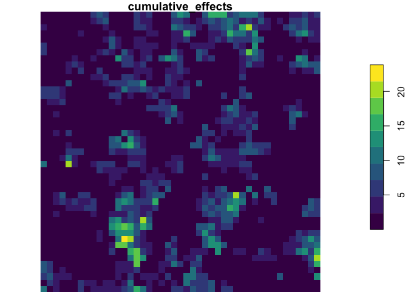

<!-- README.md is generated from README.Rmd. Please edit that file -->

# rcea 

<!-- badges: start -->

[](https://github.com/david-beauchesne/rcea/actions/workflows/R-CMD-check.yaml)
[](https://github.com/david-beauchesne/rcea/actions/workflows/pkgdown.yaml)
[](https://github.com/david-beauchesne/rcea/actions/workflows/test-coverage.yaml)
[](https://codecov.io/gh/david-beauchesne/rcea)
[](https://CRAN.R-project.org/package=rcea)
[](https://choosealicense.com/licenses/gpl-2.0/)
[](https://lifecycle.r-lib.org/articles/stages.html#experimental)
[](https://www.repostatus.org/#concept)
[](#)
<!-- badges: end -->

The goal of the R package `rcea` is to **{{ PLEASE ADD A FEW LINES }}**

## Installation

You can install the development version from
[GitHub](https://github.com/) with:

``` r
# install.packages("remotes")
remotes::install_github("david-beauchesne/rcea")
```

Then you can attach the package `rcea`:

``` r
library("rcea")
```

## Overview

``` r
library(rcea)
library(stars)
#> Loading required package: abind
#> Loading required package: sf
#> Linking to GEOS 3.11.2, GDAL 3.6.3, PROJ 9.2.0; sf_use_s2() is TRUE

# Data
drivers <- rcea:::drivers 
vc <- rcea:::vc
sensitivity <- rcea:::sensitivity
metaweb <- rcea:::metaweb
trophic_sensitivity <- rcea::trophic_sensitivity
trophic_sensitivity$Sensitivity <- trophic_sensitivity$Sensitivity2
#> Warning: Unknown or uninitialised column: `Sensitivity2`.
pal <- viridis::viridis

# Plots 
plot(merge(drivers), col = pal)
```


``` r
plot(merge(vc), col = pal(1))
#> Warning in plot.stars(merge(vc), col = pal(1)): breaks="quantile" leads to a
#> single class; maybe try breaks="equal" instead?
```


``` r
# Cumulative footprint
foot_dr <- cea_extract(drivers, cumul_fun = "footprint")
foot_vc <- cea_extract(vc, cumul_fun = "footprint")
plot(foot_dr, col = pal)
```


``` r
plot(foot_vc, breaks = "equal", col = pal)
```


``` r
# Cumulative exposure 
expo <- exposure(drivers, vc, "stars")

# Extract specific attributes and evaluate cumulative exposure
dr_sel <- c("driver1","driver5")
vc_sel <- c("vc4","vc7","vc10","vc12")
dat <- cea_extract(expo, dr_sel = dr_sel, vc_sel = vc_sel) 
plot(dat["vc4"], col = pal) # Exposure of vc4 to driver1 and driver5
```


``` r
# Cumulative effects assessment (Halpern et al. 2008)
halpern <- cea(drivers, vc, sensitivity, "stars")

# Cumulative effects of all drivers on all vc
dat <- cea_extract(halpern, cumul_fun = "drivers")
plot(merge(dat), breaks = "equal", col = pal)
```


``` r
# Cumulative effects of all drivers on each vc
dat <- cea_extract(halpern, cumul_fun = "vc") 
plot(merge(dat), breaks = "equal", col = pal)
```


``` r
# Full cumulative effects
dat <- cea_extract(dat, cumul_fun = "full") 
plot(dat, breaks = "equal", col = pal)
```



``` r
# Network-scale cumulative effects assessment (Beauchesne et al. 2021)
beauchesne <- ncea(drivers, vc, sensitivity, metaweb, trophic_sensitivity)
#> Adding missing grouping variables: `vc_id`
#> Adding missing grouping variables: `vc_id`

# Net cumulative effects
dat <- cea_extract(beauchesne$net, cumul_fun = "full") 
plot(dat, breaks = "equal", col = pal)
```



``` r
# Direct cumulative effects
dat <- cea_extract(beauchesne$direct, cumul_fun = "full") 
plot(dat, breaks = "equal", col = pal)
```


``` r
# Indirect cumulative effects
dat <- cea_extract(beauchesne$indirect, cumul_fun = "full") 
plot(dat, breaks = "equal", col = pal)
```



## Citation

Please cite this package as:

> Beauchesne David (2023) rcea: An R package to perform cumulative
> effects assessments. R package version 0.0.0.9000.

## Code of Conduct

Please note that the `rcea` project is released with a [Contributor Code
of
Conduct](https://contributor-covenant.org/version/2/0/CODE_OF_CONDUCT.html).
By contributing to this project, you agree to abide by its terms.
